# 5 - 频域分析法

## 频率特性 - 概念

* 输入正弦信号 $u_i = A\sin \omega t$ , 输出响应 $u_o$ 稳定时记录曲线

## 有关 $\tan,\arctan$ 的基本公式 (重点)

* $\tan (\alpha \textcolor{OrangeRed}{\pm} \beta) = \cfrac{\tan \alpha \textcolor{OrangeRed}{\pm} \tan \beta}{1 \textcolor{RoyalBlue}{\mp} \tan \alpha }$

* $\arctan \alpha \textcolor{OrangeRed}\pm \arctan \beta = \arctan \cfrac{\alpha \textcolor{OrangeRed}\pm \beta}{1 \textcolor{RoyalBlue}\mp \alpha \beta}$

## 频率特性 - 定义 1 : $G(j\omega) = A(\omega)e^{j\varphi (\omega)} = |G(j\omega)|\angle G(j\omega)$

* 对一个 **稳定** 的线性定常系统
* 给一个传递函数 $G\left( s \right) =\cfrac{\sum\limits_{i=0}^m{b_is^{m-i}}}{\sum\limits_{i=0}^n{a_is^{n-i}}}=\cfrac{B\left( s \right)}{A\left( s \right)}$
* 令 $s=j\omega$
* 那么 $G(j\omega) = A(\omega)e^{j\varphi (\omega)} = |G(j\omega)|\angle G(j\omega)$  

  * 分离实部虚部, 导出得到 $\left\{ \begin{matrix} A(\omega)=|G(j \omega)| \\ \varphi(\omega)=\angle G(j \omega)\\ \end{matrix} \right.$  

    * 其中 $A(\omega)$ 为幅值-频率特性, 简称 **幅频特性**
    * $\varphi (\omega) = \angle G(j\omega)$ 为相角-频率特性, 简称 **相角特性**

      * $\angle G(j\omega) = \angle 分子 - \angle 分母= \arctan \cfrac{虚部}{实部}$
* $\left\{ \begin{aligned}	|G\left( j\omega \right) |&=\frac{|C_s\left( t \right) |}{|r\left( t \right) |}\\	\angle G\left( j\omega \right) &=\angle C_s\left( t \right) -\angle r\left( t \right)\\\end{aligned} \right.$  

  * $C_s(t):$ 输出
  * $r(t):$ 输入
  * 输出幅值比上输入幅值
  * 输出相角减去输入相角

## 时域 - 复域 - 频域转换

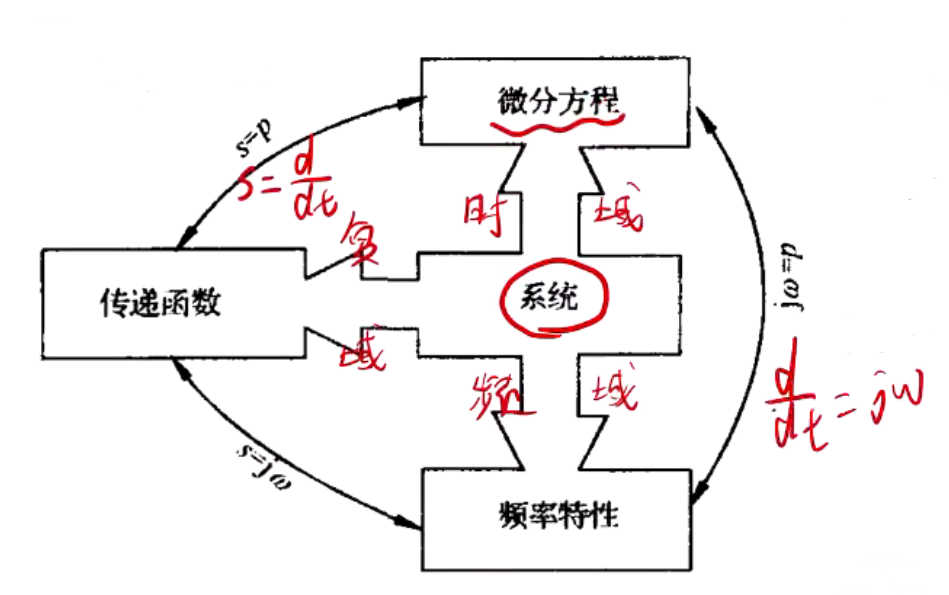​

## 典型环节 - 惯性环节 $\cfrac{1}{Ts+1}$

* $G(j\omega) = \cfrac{1}{1+jT\omega} = \cfrac{1}{1 + (T\omega)^2}-j\cfrac{T\omega}{1+(T\omega)^2}$
* $\left[ \mathrm{Re}G\left( j\omega \right) -\cfrac{1}{2} \right] ^2+\mathrm{Im}^2G(j\omega )=\left( \cfrac{1}{2} \right) ^2$
* Nyquist 曲线以 $(\frac{1}{2}, j0)$ 为圆心的半圆

  * ​
* Bode图

  * 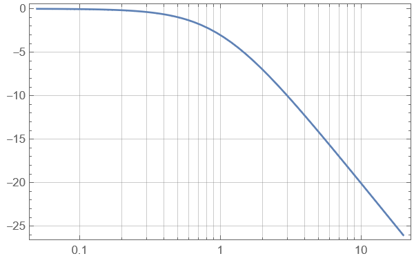​
  * 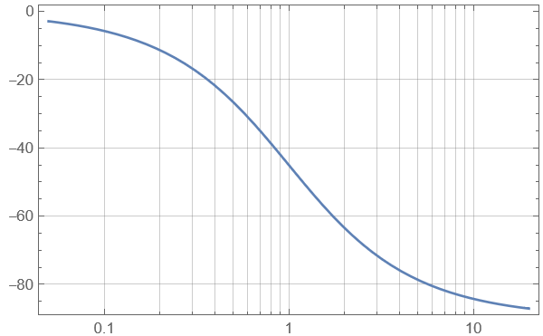​

## 对数幅值频率特性曲线 - 伯德图 (Bode)

* 对数频率特性横坐标按 $\lg \omega$ 进行分度
* $L(\omega) = 20\lg |G(j\omega)| = 20\lg A(\omega)$
* ​​

### 考试的时候画图

* 横坐标每 $5\mathrm{cm}$ 代表一个十倍频程
* 纵坐标每 $1\mathrm{cm}$ 代表一个 $10\mathrm{dB}$
* 如果特别宽的话

  * 横坐标每 $2.5\mathrm{cm}$ 代表一个十倍频程
  * 纵坐标每 $1\mathrm{cm}$ 代表一个 $20\mathrm{dB}$
* ​​

## 经典环节幅相频率特性图 (Nyquist 图)

* 比例环节 $G(s) = K$  

  * $G(j\omega) = K + j0 = Ke^{j0}$
  * $A(\omega) = |G(j\omega)| = K, \varphi (\omega) = \angle G(j\omega) = 0\degree$
  * 幅值为 $K$ , 相角为 $0\degree$
  * 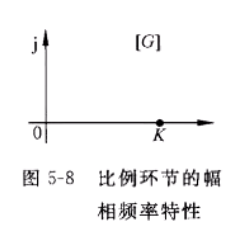​
* 微分环节 $G(s) = s$  

  * $G(j\omega) = j\omega$
  * $A(\omega) = |G(j\omega)| = 0$
  * $\omega = 0, \varphi (\omega) = 0$
  * $\varphi (\omega) = \lim\limits_{\omega \to +\infty}\arctan \cfrac{虚部}{实部} = \arctan \infty = 90\degree$
  * 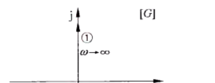​
* 积分环节 $G(s)=\cfrac{1}{s}$  

  * $G(j\omega) = \cfrac{1}{j\omega} = -j\cfrac{1}{\omega}$
  * $A(\omega) = \cfrac{1}{\omega}$
  * $\varphi (\omega = 0) = \lim\limits_{\omega \to 0}\arctan \cfrac{虚部}{实部} = -90\degree$
  * $\varphi (\omega) =\lim\limits_{\omega \to +\infty} \arctan \cfrac{虚部}{实部} = 0\degree$
  * 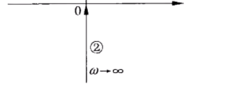​
* 惯性环节 $G(s) = \cfrac{1}{Ts+1}$  

  * $G(j\omega) = \cfrac{1}{1+jT\omega} = \cfrac{1}{\sqrt{1+T^2\omega^2}}e^{j\arctan T\omega}$
  * $A(\omega) = \cfrac{1}{\sqrt{1+T^2\omega^2}}$
  * $\varphi (\omega) = -\arctan T\omega$
  * $\omega = 0, A(\omega) = 1, \varphi (\omega) = 0\degree$
  * $\omega \to \infty, A(\omega) = 0, \varphi (\omega) = -90\degree$
  * 只绘制下半圆
  * 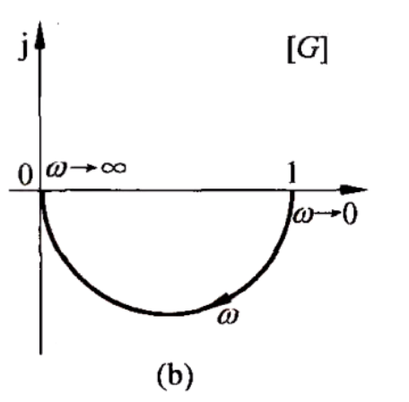​
  * 证明该轨迹是个圆

    * $G(j\omega) = \cfrac{1}{1+jT\omega} = \cfrac{1}{1+T^2\omega^2} - j\cfrac{T\omega}{1+T^2\omega^2} = X+jY$
    * $X = \cfrac{1}{1+T^2\omega^2}$
    * $Y = -\cfrac{T\omega}{1+T^2\omega^2} = -T\omega X$
    * $T\omega = -\cfrac{Y}{X}$ , 代入 $X = \cfrac{1}{1+T^2\omega^2}$ 的分母得

      * $X=\cfrac{1}{1 + \cfrac{Y^2}{X^2}}$
      * $1 = \cfrac{X}{X^2 + Y^2}\Rightarrow X^2 + Y^2 = X$
      * $X^2 - X + Y^2 = 0 \Rightarrow X^2 - 2\times \cfrac{1}{2}X + \cfrac{1}{4} + Y^2 = \cfrac{1}{4}$
      * $\left(X-\cfrac{1}{2}\right)^2 +Y^2 = \left(\cfrac{1}{2}\right)^2$
      * 因为 $Y$ 只有负值, 所以只有下半圆
* 一阶复合微分 $G(s) = Ts + 1$  

  * $G(j\omega) = 1 + jT\omega = \sqrt{1 + T^2\omega^2}e^{-j\arctan T\omega}$
  * $A(\omega) = \sqrt{1 + T^2\omega^2}$
  * $\varphi (\omega) = \arctan T\omega$
  * 实部为常数 $1$ , 虚部与 $\omega$ 成正比

    * 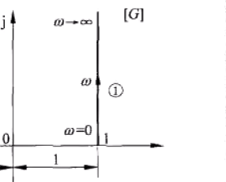​
* 不稳定的一阶复合微分环节传递函数 $G(s) = Ts-1$  

  * $G(j\omega) = jT\omega - 1$
  * $A(\omega) = -1 + jT\omega$
  * $\varphi (\omega) = \arctan \cfrac{T\omega}{-1} = 180 \degree -\arctan T\omega$
  * 不稳定环节的特性都是**非最小相位**
* 二阶震荡环节 $G(s)= \cfrac{1}{T^{2}s^{2}+2T \zeta  s+1}= \cfrac{\omega_n^2}{s^{2}+2 \zeta \omega_n s + \omega _{n}^{2}}  \quad 0<s<1$  

  * $\omega_n = \cfrac{1}{T}$
  * $G(j\omega) = \cfrac{1}{\left(1-\cfrac{\omega^2}{\omega_n^2}\right)^2 + j2\zeta \cfrac{\omega}{\omega_n}}$
  * $A(\omega) = \cfrac{1}{\sqrt{(1- \cfrac{\omega ^{2}}{\omega _{n}^{2}})^{2}+4 \zeta ^{2}\cfrac{\omega ^{2}}{\omega _{n}^{2}}}}$
  * $\varphi (\omega) = -\arctan \cfrac{2\zeta \cfrac{\omega}{\omega_n}}{1-\cfrac{\omega^2}{\omega_n^2}}$  

    * $\omega = 0, G(j0) = 1\angle 0\degree$
    * $\omega = \omega_n, G(j\omega_n) =\cfrac{1}{2\zeta}\angle -90\degree$
    * $\omega = \infty, G(j\infty) = 0\angle -180\degree$
  * 绘制不同阻尼比 $\zeta$ 下的Nyquist图

    * 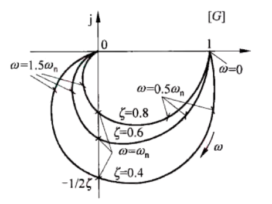​
  * 谐振峰值- $A(\omega)$ 取最大值时, $M_r = \max \{A(\omega)\}, \omega_r = \argmax \{A(\omega)\}$  

    * $M_r:$ 谐振峰值
    * $\omega_r :$ 谐振频率
    * $\color{OrangeRed}\omega_r = \omega_n \sqrt{1-2\zeta^2} \quad (0<\zeta<0.707)$
    * $\color{OrangeRed}M_r = A(\omega_r) = \cfrac{1}{2\zeta\sqrt{1-\zeta^2}}$
    * 只有阻尼比 $\color{OrangeRed}\zeta \leqslant 0.707$ 时候才会出现 $\omega_r , M_r$  

      * 如果 $\zeta > 0.707, \omega_r = \omega_n\sqrt{1-2\zeta^2}$ 中根号项小于0, 数学上是不存在的
      * 如果 $\zeta = 0, 1-2\zeta^2 = 1, \omega_r = \omega_n, M_r \to \infty$
* 不稳定的二阶震荡环节 $G(s) = \cfrac{\omega_n^2}{s^2-2\zeta\omega_n s + \omega_n^2}$

  * $G(j\omega) = \cfrac{1}{1-\cfrac{\omega^2}{\omega_n^2}-j2\zeta\cfrac{\omega}{\omega_n}}$
  * $A(\omega) = \cfrac{1}{\sqrt{(1- \cfrac{\omega ^{2}}{\omega _{n}^{2}})^{2}+4 \zeta ^{2}\cfrac{\omega ^{2}}{\omega _{n}^{2}}}}$
  * $\varphi (\omega) = -360\degree + \arctan \cfrac{2\zeta \cfrac{\omega}{\omega_n}}{1-\cfrac{\omega^2}{\omega_n^2}}$
* 二阶复合微分环节 $G(s) = T^2s^2+2\zeta Ts + 1 = \cfrac{1}{\omega_n^2}s^2 + \cfrac{2\zeta }{\omega_n}s + 1$  

  * $G(j\omega) = \left(1-\cfrac{\omega^2}{\omega_n^2}\right)+j2\zeta\cfrac{\omega}{\omega_n}$
  * $A(\omega) = \sqrt{(1- \cfrac{\omega ^{2}}{\omega _{n}^{2}})^{2}+4 \zeta ^{2}\cfrac{\omega ^{2}}{\omega _{n}^{2}}}$
  * $\varphi(\omega)= \arctan \cfrac{2 \zeta \cfrac{\omega}{\omega _{n}}}{1- \cfrac{\omega ^{2}}{\omega _{n}^{2}}}$
* 不稳定二阶复合微分 $G(j\omega) = 1- \cfrac{\omega ^{2}}{\omega _{n}^{2}}-j2 \zeta \cfrac{\omega}{\omega _{n}}$  

  * $A(\omega) = \sqrt{(1- \cfrac{\omega ^{2}}{\omega _{n}^{2}})^{2}+4 \zeta ^{2}\cfrac{\omega ^{2}}{\omega _{n}^{2}}}$
  * $\varphi(\omega)=360\degree - \arctan \cfrac{2 \zeta \cfrac{\omega}{\omega _{n}}}{1- \cfrac{\omega ^{2}}{\omega _{n}^{2}}}$
* 延迟环节 $G(s) = e^{-\tau s}$  

  * $G(j\omega) = e^{-j\tau\omega} = cos(-\omega\tau) + j\sin(-\omega\tau)$
  * $A(\omega) = 1$
  * $\varphi (\omega) =\arctan \cfrac{\sin (-\omega\tau)}{\cos (-\omega\tau)}=\arctan \cfrac{-\sin (\omega\tau)}{\cos (\omega \tau)} =\arctan (-\tan (\omega\tau))= -\tau\omega$
  * ​

### 汇总表格

|环节|传递函数 $G\left( s \right)$|$G\left( j\omega \right)$|
| :--------: | :---------: | :-: |
|比例|$K,(K>0)$|$\pm K$|
|微分|$s$|$j\omega$|
|积分|$\cfrac{1}{s}$|$\cfrac{1}{j\omega}$|
|惯性|$\cfrac{1}{1+Ts}\quad (T>0)$|$\cfrac{1}{1+j\omega T}$|
|一阶微分|$1+Ts\quad (T>0)$|$1+j\omega T$|
|震荡|$\cfrac{\omega_n^2}{s^2 + 2\zeta \omega_n s + \omega_n^2}$|$\cfrac{1}{1-\cfrac{\omega^2}{\omega_n^2}+j2\zeta \cfrac{\omega}{\omega_n}}$|
|二阶微分|$s^2 + 2\zeta \omega_n s + \omega_n^2$|$1 - \cfrac{\omega^2}{\omega_n^2} + j2\zeta\cfrac{\omega}{\omega_n}$|
|延迟|$e^{-\tau s}$|$e^{-j\tau\omega}$|

## 绘制 Nyquist 图

### 步骤

* 根据零极点分布图, 计算 $\lim\limits_{\omega \to 0}G(j\omega)$ 与 $\lim\limits_{\omega \to \infty}G(j\omega)$

  * 原点处有零点或极点时, 计算 $\lim\limits_{\omega \to 0^{+}}G(j\omega)$
  * 在原点附近画一个半径为 $\varepsilon\to0$ 的小圆以便于计算 $\lim\limits_{\omega \to 0}G(j\omega)$

    * 零点到该点的向量与正实轴的夹角减去极点指向该点的向量与正实轴的夹角
  * ​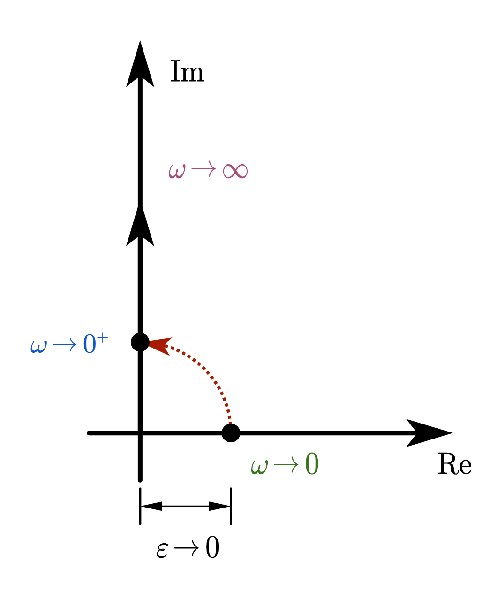​
* 绘制中间点
* 必要时画出 $G(j\omega)$ 与实轴交点

  * 与实轴交点处的频率成为穿越频率 $\omega_x$ 或 $\omega_g$
  * 想求交点处的模值 $A(\omega_g)$  

    * 求 $\omega_g$ , 令 $\mathrm{Im}[G(j\omega_g)]=0$ 或 $\varphi (\omega_g)=\angle G(j\omega_g) = k\pi\quad (k=0,\pm 1, \pm 2, \cdots)$
    * 求 $A(\omega_g) = \mathrm{Re}[G(j\omega_g)]=G(j\omega_g)$
* 可以用计算器进行辅助验证

  * 求 $\omega \to 0^{+}$ 时, 可以设 $s = 0.01i$
  * 利用计算器算出起始点

> 例: 系统开环传递函数 $G(s)H(s)=\cfrac{s-1}{s(s+2)}$ , 绘制概略 Nyquist 图

* $G(j\omega)H(j\omega) = \cfrac{j\omega - 1}{j\omega (j\omega + 2)}$
* $A(\omega)=|G(j\omega)H(j\omega)| = \cfrac{\sqrt{\omega^2 + 1}}{\omega\sqrt{\omega^2 + 2^2}}$  

  * 相当于每个环节原地求模值
* $\varphi (\omega) = \angle G(j\omega)H(j\omega) = 分子-分母=\arctan \cfrac{\omega}{-1} - 90\degree - \arctan \cfrac{\omega}{2}$  

  * $\varphi (\omega) = 180\degree - \arctan \omega - 90\degree - \arctan\cfrac{\omega}{2}$
  * $\arctan \cfrac{\omega}{-1}$ 可以画图解决

    * ​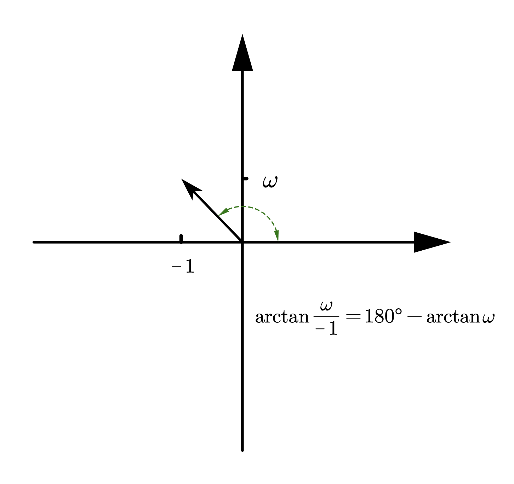​
* 计算零极点

  * $z_1 = 1, m=1$
  * $p_1 = 0, p_2 = -2,n=2$
* $\omega \to 0: |G(j\omega)|\angle G(j\omega) = \infty\angle 180\degree - 0\degree - 0\degree = \infty\angle 180\degree$  

  * 零点或极点有落在原点的, 不能直接从原点直接穿过, 要绕过去
  * 设一个半径无穷小的圆在原点周围

    * ​​
    * 计算 $\omega = 0$ 时, 零点到该点的向量与正实轴的夹角减去极点指向该点的向量与正实轴的夹角
* $\omega \to 0^{+}$  

  * $|G(j\omega)|\angle G(j\omega) = \infty\angle 180\degree - 90\degree - 0\degree = \infty\angle 90\degree$
  * $\mathrm{Re}[G(j\omega)H(j\omega)] = \cfrac{3}{4}$ , 渐近线在 $\omega = \cfrac{3}{4}$ 处
* $\omega \to \infty: A(\omega) = 0, \varphi (\omega) = -\cfrac{\pi}{2}$
* 与虚实轴交点

  * $G(j\omega)H(j\omega) = \cfrac{3}{\omega^2 + 4} + j\cfrac{2-\omega^2}{\omega(\omega^2 + 4)}$  

    * 与实轴交点:令 $\mathrm{Im}[G(j\omega)H(j\omega)]=0$ , 求得 $\omega$ 后代入 $\mathrm{Re}[G(j\omega)H(j\omega)]$  

      * $\omega^2 = 2\Rightarrow \omega = \sqrt{2}$
      * $\mathrm{Re}[G(j\omega)H(j\omega)]=\cfrac{3}{2+4}=\cfrac{1}{2}$ , 交点在 $0.5$ 处
    * 与虚轴交点: 令 $\mathrm{Re}[G(j\omega)H(j\omega)]=0$ ,求得 $\omega$ 后代入 $\mathrm{Im}[G(j\omega)H(j\omega)]$  

      * 不存在
* 画出图形

  * 自己画是画成这样

    * ​
  * 正确画法是别忘记**加虚线**

    * ​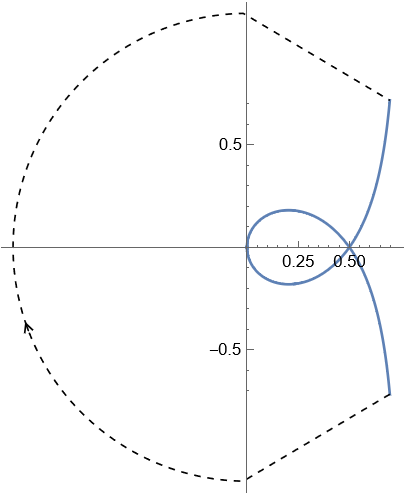​

> 例: 某 $0$ 型单位反馈系统 $G(s)=\cfrac{K}{(T_1s+1)(T_2s+1)}\quad K,T_1,T_2 > 0$ , 绘制概略 Nyquist 图

* $G(j\omega) = \cfrac{K}{(jT_1\omega + 1)(jT_2\omega + 1)}$
* $A(\omega) = \cfrac{K}{\sqrt{1 + T_1^2\omega^2}\sqrt{1+T_2^2\omega^2}}$
* $\varphi (\omega) = 0\degree - \arctan \cfrac{T_1\omega}{1} - \arctan \cfrac{T_2\omega}{1}$
* 计算零极点

  * $m=0$
  * $p_1 = -\cfrac{1}{T_1}, p_2 = -\cfrac{1}{T_2}, n=2$
  * 无零极点落在原点处
* $\omega \to 0: \varphi (\omega) = 0\degree, A(\omega) = K$
* $\omega \to \infty: \varphi (\omega) = -\cfrac{\pi}{2}-\cfrac{\pi}{2}=-180\degree, A(\omega) = \cfrac{K}{\infty} = 0$
* 与虚实轴交点

  * $G(j\omega )=\cfrac{K\left( 1-T_1T_2\omega ^2 \right)}{(1+T_{1}^{2}\omega ^2)(1+T_{2}^{2}\omega ^2)}-j\cfrac{(T_1+T_2)\omega}{(1+T_{1}^{2}\omega ^2)(1+T_{2}^{2}\omega ^2)}$
  * 令 $\mathrm{Re}[G(j\omega)] = 0$  

    * $\omega = \cfrac{1}{\sqrt{T_1T_2}}$
  * 令 $\mathrm{Im}[G(j\omega)] = 0$  

    * $\omega = 0$
    * 除了原点以外, 系统Nyquist曲线不与实轴产生交点
* 最终结果大概长这样

  * ​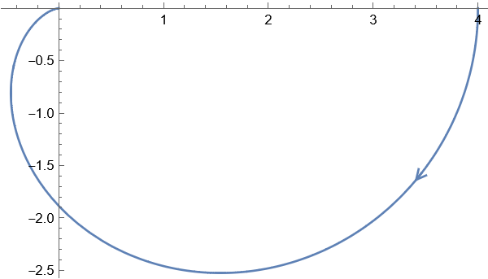​

> 例: 系统开环传递函数 $G(s)H(s) = \cfrac{K}{s(T_1s+1)(T_2s+1)} \quad K,T_1,T_2 > 0$ , 绘制概略Nyquist曲线

* $G(j\omega)H(j\omega) = \cfrac{K}{j\omega(jT_1\omega + 1)(jT_2\omega + 1)}$
* $A(\omega) = \cfrac{K}{\omega\sqrt{1 + T_1^2\omega^2}\sqrt{1+T_2^2\omega^2}}$
* $\varphi (\omega) = 0\degree - 90\degree - \arctan \cfrac{T_1\omega}{1} - \arctan \cfrac{T_2\omega}{1}$
* 计算零极点

  * $m=0$
  * $p_1 = 0, p_2 = -\cfrac{1}{T_1}, p_3 = -\cfrac{1}{T_2}, n = 3$
* 计算 $\omega \to 0, \omega \to 0^{+}, \omega \to \infty$  

  * 由于有一个极点落在原点, 所以要计算 $\omega \to 0^{+}$
  * $\omega \to 0: A(\omega) \to \infty, \varphi (\omega) = 0 \degree$
  * $\omega \to 0^{+} : A(\omega) \to \infty, \varphi (\omega) = 0\degree - 90\degree, \mathrm{Re}[G(j\omega)H(j\omega)]=-K\omega$  

    * 渐近线在实轴 $-K\omega$ 处
  * $\omega \to \infty: A(\omega) \to 0, \varphi (\omega) = -270\degree$
  * 画一个在原点, 半径 $\epsilon \to 0$ 的圆

    * ​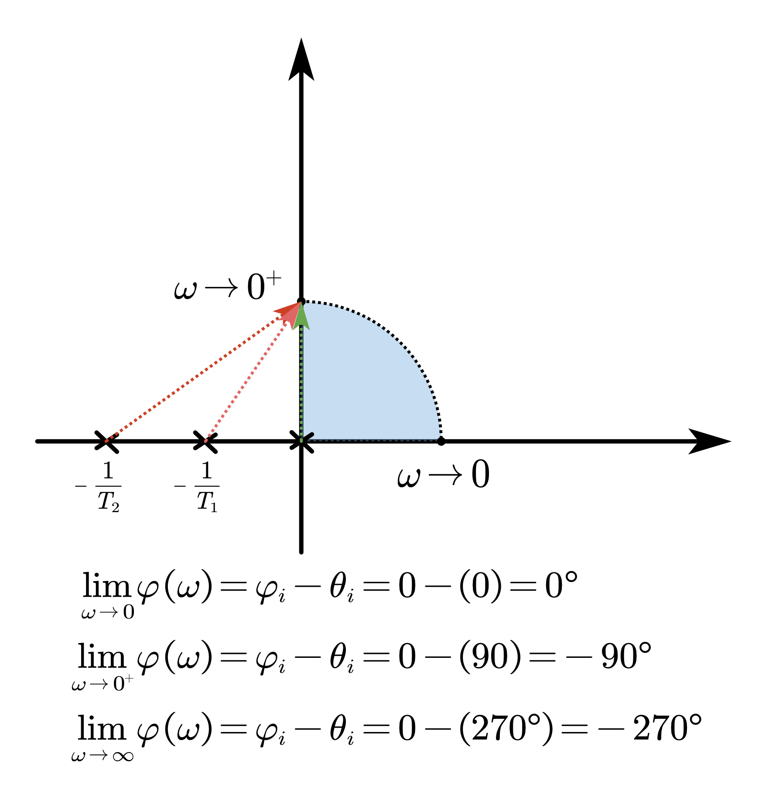​
* 计算与虚实轴交点

  * $G\left( j\omega \right) H\left( j\omega \right) =\cfrac{-K(T_1+T_2)\omega}{\omega (1+T_{1}^{2}\omega ^2)(1+T_{2}^{2}\omega ^2)}+j\cfrac{T_1T_2\omega ^2-1}{\omega (1+T_{1}^{2}\omega ^2)(1+T_{2}^{2}\omega ^2)}$
  * 与虚轴交点

    * 令 $\mathrm{Re}[G(j\omega)] = 0$ , 求 $\omega$ , 代入 $\mathrm{Im}[G(j\omega)]$
    * 除了 $\omega = 0$ 以外, 无实轴交点
  * 与实轴交点

    * 令 $\mathrm{Im}[G(j\omega)] = 0$ , 求 $\omega$ , 代入 $\mathrm{Re}[G(j\omega)]$
    * $\omega = \cfrac{1}{\sqrt{T_1T_2}}$
* 画出Nyquist图

  * 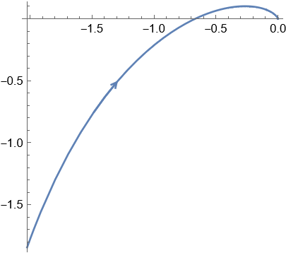​
  * 正确绘制记得画虚线
  * 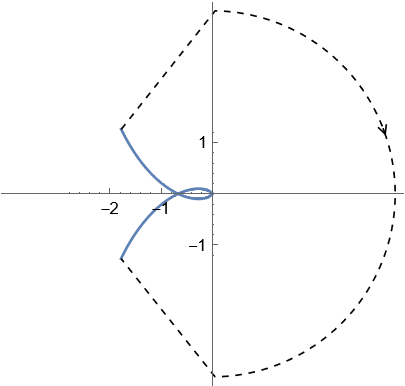​

> 例: 系统开环传递函数 $G(s)H(s) = \cfrac{K(-\tau s + 1)}{s(Ts + 1)}\quad K,\tau,T>0$

* $G(j\omega)H(j\omega) = \cfrac{K(-j\tau\omega + 1)}{j\omega(jT\omega + 1)}$
* 分出实部和虚部 $G\left( j\omega \right) H\left( j\omega \right) =-\cfrac{K\left( T+\tau \right) \omega}{\omega \left( 1+T^2\omega ^2 \right)}-j\cfrac{1-T\tau \omega ^2}{\omega \left( 1+T^2\omega ^2 \right)}$
* 出现了 $s$ 的系数为**负数**, 不能用零极点分布图来判断, 要用原始的方法

  * 本来分子应该是 $\arctan \cfrac{-\tau \omega}{1}$ , 变换成 $360\degree - \arctan \cfrac{\tau\omega}{1}$
  * 这回变为 $\varphi (\omega) = \color{OrangeRed} 360 \degree  - \arctan \tau \omega \color{RoyalBlue} -90\degree - \arctan \cfrac{T\omega}{1}$
  * 或者直接分离实部和虚部后, 计算在 $\omega \to 0^+, \omega \to \infty$ 的实部和虚部后计算夹角

    * $\omega \to 0^+$  

      * $\lim\limits_{\omega \rightarrow 0^+} \mathrm{Re}\left[ G\left( j\omega \right) H\left( j\omega \right) \right] =-\cfrac{K\left( T+\tau \right)}{1+T^2\omega ^2} = X$
      * $\lim\limits_{\omega \rightarrow 0^+} \mathrm{Re}\left[ G\left( j\omega \right) H\left( j\omega \right) \right] =-\cfrac{K\left( 1-T\tau \omega ^2 \right)}{\omega \left( 1+T^2\omega ^2 \right)}=-\cfrac{K}{0^+}=-\infty =Y$
      * 计算该点 $(X,Y)$ 在复平面第三象限且无限向下, 夹角 $-90\degree$
* $\omega \to 0^{+}: \varphi (\omega) \to -90\degree (270\degree), A(\omega) \to \infty$
* $\omega \to \infty:\varphi (\omega) \to -270\degree (90\degree), A(\omega)\to0$
* 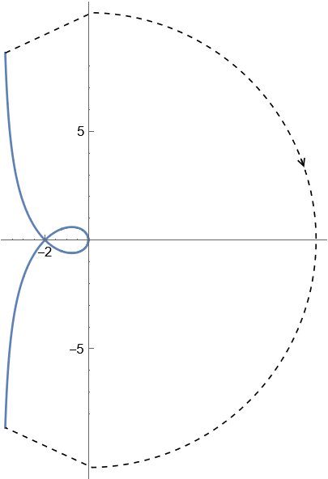​

## Bode 图中的典型环节

|环节|传递函数 $G\left( s \right)$|斜率变化|角度变化|
| :------------: | :---------: | :--------: | :--------: |
|比例|$K$|$0 \mathrm{dB/dec}$|$0\degree$|
|微分|$s$|$+20 \mathrm{dB/dec}$|$+90\degree$|
|积分|$\cfrac{1}{s}$|$-20 \mathrm{dB/dec}$|$-90\degree$|
|惯性|$\cfrac{1}{Ts+1}$|$-20 \mathrm{dB/dec}$|$0\degree \sim -90\degree$|
|一阶复合微分|$Ts+1$|$+20 \mathrm{dB/dec}$|$0\degree \sim +90\degree$|
|二阶振荡|$\cfrac{1}{\left(\cfrac{s}{\omega _{n}}\right)^{2}+2 \zeta \cfrac{s}{\omega _{n}}+1}$|$-40 \mathrm{dB/dec}$|$0\degree \sim -180\degree$|
|二阶复合微分|$\left(\cfrac{s}{\omega _{n}}\right)^{2}+2 \zeta \cfrac{s}{\omega _{n}}+1$|$+40 \mathrm{dB/dec}$|$0\degree \sim +180\degree$|
|延迟环节|$e^{-\tau s}$|$0$|$0\degree\sim+\infty$|

## 绘制系统 Bode 图

### 绘制方法

* 化 $G(j\omega)$ 为 **尾 1 标准型** ( ((20221019161541-3smy2i7 '传递函数-开环增益')) )
* 按顺序列出转折频率
* 确定基准线

  * 基准点 $\omega = 1, L(\omega) = 20\lg K$
  * 斜率 $-20\mathrm{dB/dec}$
* 根据 ((20221019200135-mczo8tc 'Bode 图中的典型环节')) 叠加作图
* 修正 (一般不需要)

  * 两个惯性环节转折频率接近时, 一个惯性环节向下修正 $3\mathrm{dB/dec}$
  * 振荡环节 $\zeta \notin (0.3, 0.8)$ 时
* 检查

  * $L(\omega)$ 最右端斜率为 $-20(n-m)\mathrm{dB/dec}$
  * 转折点数 $=$ 惯性+一阶复合微分+震荡+二阶复合微分
  * $\varphi (\omega) = -90\degree (n-m)$
* 注意

  * ​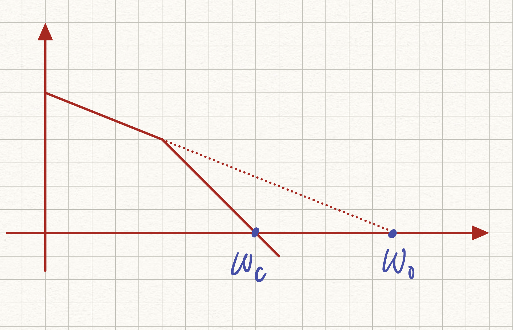​
  * **基准线** **及其 ​**​**延长线****​ ​**与 $0\mathrm{dB}$ 线的交点为 $\omega_0$  

    * $K = \omega_0^v, \omega_0=K^{\frac{1}{v}}$
  * 截止频率 $\omega_c:$ 对数幅频曲线与 $0\mathrm{dB/dec}$ 线的交点

    * 求法1: 横坐标等距等比
    * 求法2: $|G(j\omega_c)|=1$ , 用计算器 SOLVE 求出精确值
    * 求法3: $|G(j\omega_c)|=1$ , 略去各环节取模运算中实部虚部较小者

> 例: 已知开环传递函数 $G(s) = \cfrac{64(s+2)}{s(s+0.5)(s^2+3.2s+64)}$ , 试绘制开环系统的 Bode 图

* 化为 **尾1标准型** 

  * $G(s)=\cfrac{4\left( \cfrac{s}{2}+1 \right)}{s\left( \cfrac{s}{0.5}+1 \right) \left( \left( \cfrac{s}{8} \right) ^2+0.05s+1 \right)}$
  * 开环增益 $K=4$
* 列写转折频率

  * $G(j\omega )=\cfrac{4\left( \cfrac{j\omega}{2}+1 \right)}{j\omega \left( \cfrac{j\omega}{0.5}+1 \right) \left( \left( \cfrac{j\omega}{8} \right) ^2+0.05j\omega +1 \right)}=\cfrac{4\left( \cfrac{j\omega}{2}+1 \right)}{j\omega \left( \cfrac{j\omega}{0.5}+1 \right) \left( j0.05\omega +1-\left( \cfrac{\omega}{8} \right) ^2 \right)}$  

    * 振荡环节要分离出实部和虚部, 以便后续算 $\color{OrangeRed}\arctan$
  * $\omega _1=0.5,\omega _2=2,\omega _3=8,K=4,v=1$  

    * 分母有一个 $s\Rightarrow 1$ 型系统
    * 写成 $\cfrac{s}{\omega_{t}}$ , 分母就是转折频率 $\omega_t$ (Turning Frequency)
    * 三个转折频率从小到大排序
* 基准线

  * 基准点 $\omega = 1, L(\omega) = 20\lg K = 20\lg 4 = 12.0412,$ 斜率 $-20\mathrm{dB/dec}$
  * 延长线交 $0\mathrm{dB}: \omega_0 = K^{\frac{1}{v}}=4$
* 标转折频率到图上

  * 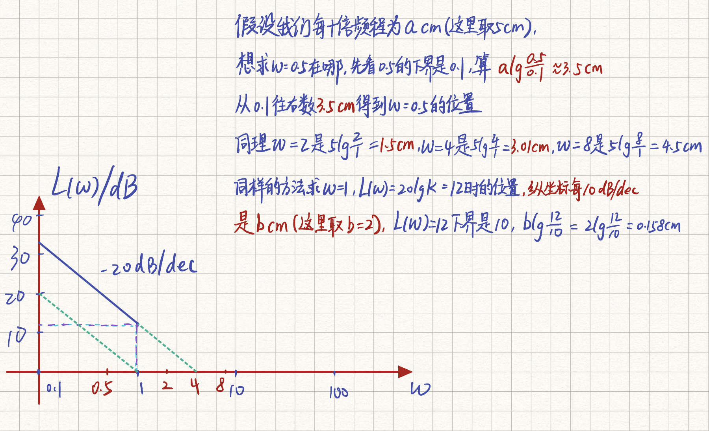​
* 叠加作图

  * 对转折频率做垂直的虚线
  * 写题顺便记得学一下下图绿色的线, 画斜率为 $-20,-40,-60\mathrm{dB/dec}$ 的参考线, 方便到时候用尺子直接平移
  * 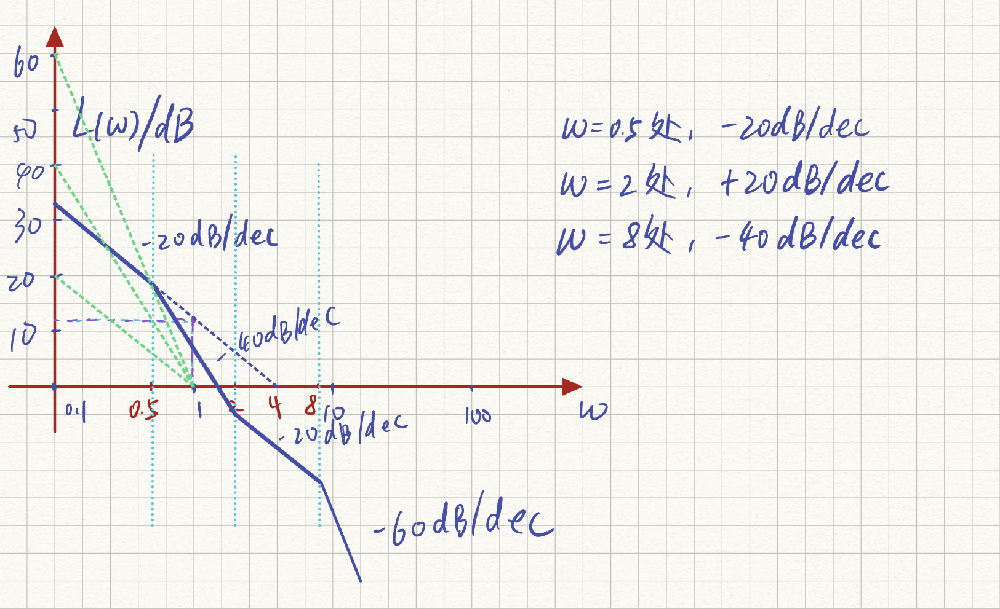​
* 求截止频率 $\omega_c:$ 曲线穿过 $0\mathrm{dB/dec}$ 时候的频率

  * 方法1: 令 $|G(j\omega _c)|=\cfrac{4\sqrt{\left( \cfrac{\omega _c}{2} \right) ^2+1}}{\omega _c\sqrt{\left( \cfrac{\omega _c}{0.5} \right) ^2+1}\sqrt{\left( 0.05\omega _c \right) ^2+\left( 1-\left( \cfrac{\omega _c}{8} \right) ^2 \right) ^2}}=1$  

    * 用计算器 SOLVE 法求得 $\omega_c \approx 1.590$
  * 方法2: 略去较小者 $|G(j\omega _c)|=\cfrac{4\cdot 1}{\omega _c\cdot \cfrac{\omega _c}{0.5}\cdot 1}=1\Rightarrow \omega _c=\sqrt{2}$  

    * 用这个方法的前提必须是 **作图规范** , 肉眼观察 $\omega_c$ 落在的区间
    * 观察得到 $\omega_c > 0.5, \omega_c < 2, \omega_c < 8$
    * 所以 $\cfrac{\omega _c}{0.5}>1,\cfrac{\omega _c}{2}<1,\cfrac{\omega _c}{8}<1,0.05\omega _c=\cfrac{\omega _c}{20}<1$
    * 略去根号中 **较小** 的项, 如果比 $1$ 大那就 略去 ​$11$
    * 因此得 $\cfrac{4\cdot 1}{\omega _c\cdot \cfrac{\omega _c}{0.5}\cdot 1}=1\Rightarrow \omega _c=\sqrt{2}$
* 计算机绘图结果

  * 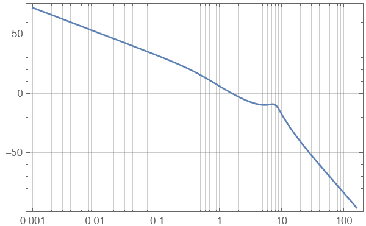​
  * 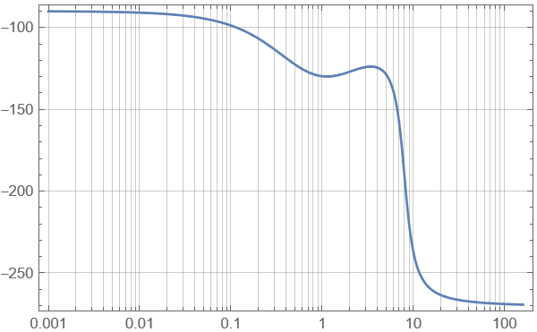​

    * 变化解读

      * 由于积分环节 $\cfrac{1}{s}$ , 相角从 $0\degree$ 突变为 $-90\degree$
      * 遇到惯性环节 $\cfrac{1}{0.5s+1}$ , 相角往 $-90\degree - 90\degree=-180\degree$ 进行变化
      * 遇到复合微分 $\cfrac{s}{2}+1$ , 相角往 $-180\degree + 90\degree = -90\degree$ 进行变化
      * 遇到振荡环节 $\cfrac{1}{\left(\cfrac{s}{8}\right)^{2}+0.05s+1 }$ , 相角往 $-90\degree-180\degree = -270\degree$ 进行变化
    * 考试记得**要**​**画对数相频特性曲线****, 不画是要扣分的**, 画大概的变化趋势就行
    * 相角交接频率 $\omega_g :$ 对数相频曲线穿过 $\color{OrangeRed}-180\degree$ 所对应的 $\omega$  

      * $分子-分母=-180\degree$
      * $\arctan \cfrac{\omega _g}{2}-90\degree-\arctan \cfrac{\omega _g}{0.5}-\arctan \cfrac{0.05\omega _g}{1-\left( \cfrac{\omega _g}{8} \right) ^2}=-180\degree\Rightarrow \omega _g\approx 7.699$
      * 用计算器的 SOLVE 法可以解出来

## 非最小相角系统: 在 $s$ **右半平面** 存在开环零极点或者带**纯延迟**环节

* 相角变化绝对值比最小相角的大
* 非最小相角系统 未必不稳定
* 非最小相角系统未必画 $0\degree$ 根轨迹
* 最小相角系统可以由 $L(\omega)$ 唯一确定 $G(s)$ , 而非最小相角系统不行

## 稳定性判据 - 频率域

* 系统 **稳定** $\Leftrightarrow$ 全部闭环极点均有 **负的实部**

## 频率域稳定性判据 - Nyquist 稳定性判据 : $\color{OrangeRed} Z = P-2N$

* Nyquist 稳定性判据公式: $\color{OrangeRed} Z = P-2N$
* $Z:$ 在 **右** 半平面中 **闭环** 极点的个数
* $P:$ 在 **右****​ ​**半平面中 **开环****​ ​**极点的个数
* $N:$ **开环**传递函数对应的 Nyquist 曲线包围 $\color{OrangeRed}(-1, j0)$ 点的圈数

  * 顺时针为 $\color{OrangeRed}-1$ 圈
  * 逆时针为 $\color{OrangeRed}+1$ 圈
* $Z=0$ 时系统稳定, 反之系统不稳定

  * $Z\geqslant 0$ , 算得负数一定算错了

### 注意

* 当虚轴上有开环零、极点分布时, 均从 **右方** 绕

> 例: 系统开环传递函数如下, 使用 Nyquist 稳定性判据判断系统稳定性

* (1) $G\left( s \right) =\cfrac{K}{(T_1s+1)(T_2s+1)(T_3s+1)}$  

  * 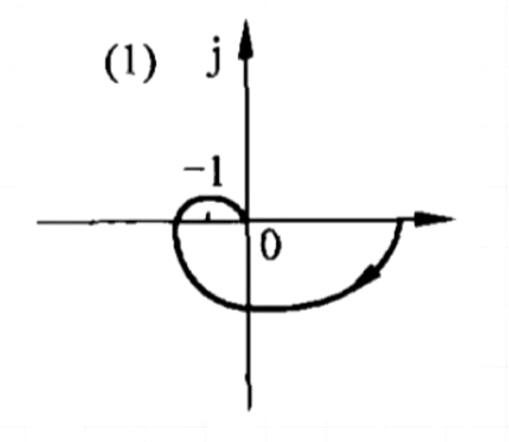​
  * 列公式: $Z = P-2N$ 以及顺 $-$ 逆 $+$
  * $P = 0$
  * $N = -1$
  * $Z = P-2N = 0-2(-1)=2 \color{OrangeRed}\neq 0$ , 系统不稳定
  * 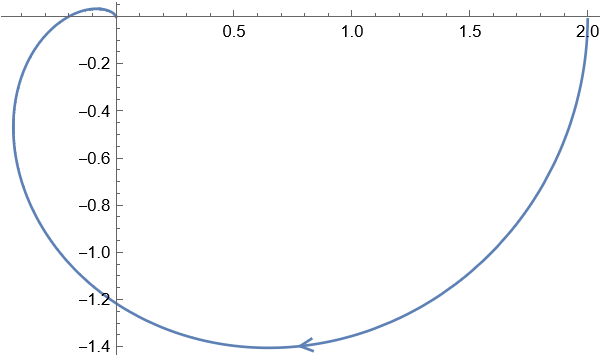​
* (2) $G(s)=\cfrac{K}{s^2(Ts+1)}$  

  * 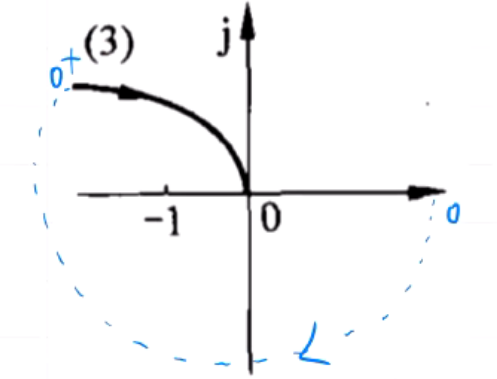​

    * 记得要补大圆弧
  * 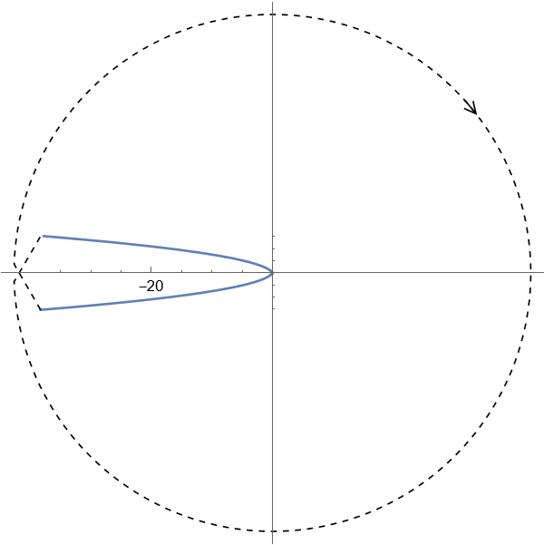​

    * Mathematica 画的是对称的图形, 实际计算只取半边
  * $P = 0$
  * $N = -1$
  * $Z = P-2N = 0-2(-1)=2\neq 0$ , 不稳定
* (3) $G(s)=\cfrac{K(T_1s+1)}{s^2(T_2s+1)}(T_1>T_2)$  

  * 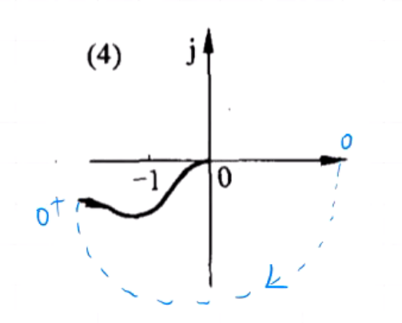​
  * $P=0$
  * $N = 0$
  * $Z=P-2N\color{OrangeRed}=0$ , 系统稳定
* (4) $G\left( s \right) =\cfrac{K(T_5s+1)(T_6s+1)}{s(T_1s+1)(T_2s+1)(T_3s+1)(T_4s+1)}$  

  * ​
  * $P=0$
  * $N=0$
  * $Z=P-2N=0,$ 系统稳定
* (5) $G(s)=\cfrac{K}{T_1s-1}(K>1)$  

  * 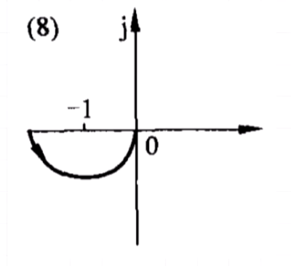​
  * $P=1$
  * $N=\cfrac{1}{2}$  

    * 最小单位为 $\cfrac{1}{2}$ , 即**绕半圈**
    * 绕 $1.5$ 圈也是可以的
  * $Z = P-2N = 1-2\times\cfrac{1}{2}\color{OrangeRed}=0,$ 稳定
* (6) $G(s)= \cfrac{K}{T_{1}s-1}(K<1)$  

  * 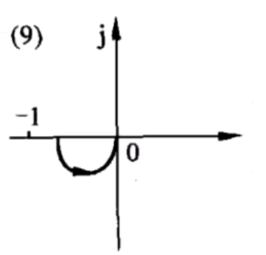​
  * $P = 1$
  * $N = 0$
  * $Z = P-2N = 1\color{OrangeRed}\neq 0,$ 不稳定

## 对数频率稳定性判据 $\left\{ \begin{aligned}	Z&=P-2N\\	N&=N_+-N_-\\\end{aligned} \right.$

* $N=N_+-N_-$  

  * 正穿越次数减去负穿越次数
* $\color{RoyalBlue}L(\omega) > 0\mathrm{dB}$ 时, $\varphi (\omega)$ 与 $-180\degree$ 或 $(2k+1)\pi$ 的交点

  * $L(\omega)>0\mathrm{dB}$ 不可或缺, 如果穿越了 $0\mathrm{dB}$ 线, 那么 往后的 都 不计算 了
* $\omega$ 增大时, $\varphi (\omega)$ 变小 且 往下穿 越 $-180\degree$ 或 $(2k+1)\pi$ , 有交点, 称为 $1$ 次负穿越
* $\omega$ 增大时, $\varphi (\omega)$ 变大 且 往上穿 越 $-180\degree$ 或 $(2k+1)\pi$ , 有交点, 称为 $1$ 次正穿越
* 如果 $\varphi (\omega)$ 贴着 $-180\degree$ 或 $(2k+1)\pi$ , 没有交点, 往 上 走, 称为 $\cfrac{1}{2}$ 次正穿越
* 如果 $\varphi (\omega)$ 贴着 $-180\degree$ 或 $(2k+1)\pi$ , 没有交点,往 下 走, 称为 $\cfrac{1}{2}$ 次负穿越

## 稳定裕度: 复平面的点到 $\color{OrangeRed}(-1,j0)$ 的距离

* 题目要求稳定裕度, 那么就 **一定要写上** <u>相角裕度 ​</u>和 <u>幅值裕度</u>

### 相角裕度 $\gamma$

#### 求法

* 求截止频率 $\omega_c = |G(j\omega)|=1$  

  * 此处的 $\omega_c$ 一定要用计算器的**SOLVE法**, 几何法都缺乏精度
* 相角裕度 $\color{OrangeRed}\gamma = 180\degree + \angle G(j\omega_c)$  

  * $\angle G(j\omega_c) = 分子-分母$

### 幅值裕度 $h$

#### 求法

* 求相角交界频率 $\omega_g: \angle G(j\omega_g) = -180\degree 或 k\pi$
* 幅值裕度 $h$  

  * $\left\{ \begin{aligned}	h&=\frac{1}{|G\left( j\omega _g \right) |}\\	h\left( \mathrm{dB} \right) &=-20\lg |G\left( j\omega _g \right) |\\\end{aligned} \right.$  

    * $\cfrac{1}{|G(j\omega_g)|}$ 是求 $\omega = \omega_g$ 时的幅值, 幅值裕度是在此基础上取倒数
    * 第二个是如果题目问幅值裕度是多少**分贝**的时候, 要记得换算

### 实际意义

* $\begin{cases}\gamma\\h\\\end{cases}$ 是系统在 $\begin{cases}\text{相角}\\\text{幅值}\\\end{cases}$ 方面的 储备量
* 一般要求 $\begin{cases}\gamma >40\degree\\h>2\left( 6\mathrm{dB} \right)\\\end{cases}$
* 对于最小相位系统, 只有 $\color{OrangeRed}\gamma , h$ 满足 都 是 正 值, 系统才稳定

  * 其实不是都 $>0$ 就行, 要 $\color{OrangeRed}\gamma > 0, h>1$ 才稳定
* 在使用相角裕度 $\gamma$ 进行判稳时候, 所需要的 $\omega_c$ 要 **用计算器求**

  * > * 求法2: $|G(j\omega_c)|=1$ , 用计算器 SOLVE 求出精确值
    >

‍
